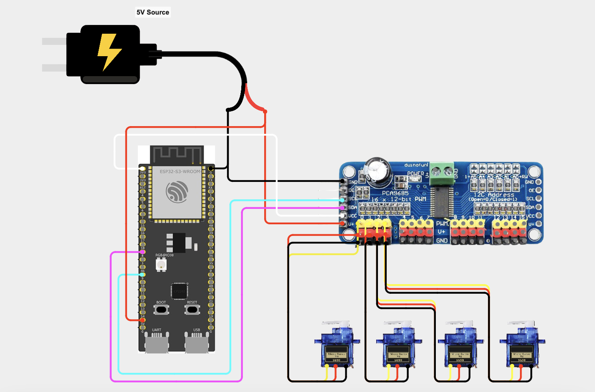

## Overview
This project is a 3-axis servo-driven robotic arm with a gripper end effector, built for simple pick-and-place tasks. An ESP32 microcontroller drives the servos through a PCA9685 PWM driver and hosts a web interface, letting the arm be controlled wirelessly from any device on the same WiFi network. Servo positions persist across power cycles, so the arm resumes its last pose on reboot, and all structural components are 3D printed from the CAD/STL files included in this repository.

## Bill of Materials
| Component | Amount  | 
| --- | --- |
| Servos w/ horns | 4 |  
| Filament (w/ supports included) | 150g | 
| Esp32 | 1 | 
| Wiring | 12 | 
| PCA9685 | 1 | 
| 5V Source | 1 |

## Getting Started / Setup
1. **Print and assemble the arm.** Print the parts in [`Stl Files/`](Stl%20Files) and assemble the arm, wiring each servo to the PCA9685 as follows:

   | Channel | Joint |
   | --- | --- |
   | 0 | Base |
   | 1 | Shoulder |
   | 2 | Elbow |
   | 3 | Gripper |

**Note:** I'd recommend printing supports in PETG and the main body components in PLA; supports use roughly 50g of filament, and the body roughly 100g.

2. **Wire the electronics.** Connect the PCA9685 to the ESP32 over I2C and power the servos per [`Images/Arm_Circuit_Diagram.png`](Images/Arm_Circuit_Diagram.png).
3. **Install the Arduino IDE dependencies:**
   - ESP32 board support (via Boards Manager)
   - `Adafruit PWM Servo Driver Library` (pulls in `Adafruit_I2CDevice`)
4. **Set your WiFi credentials.** Open [`main.ino`](main.ino) and replace the `ssid` and `password` placeholders with your network's credentials.
5. **Flash the ESP32.** Select the correct board/port in the Arduino IDE and upload the sketch.
6. **Find the arm's IP address.** Open the Serial Monitor at 115200 baud — once connected, the ESP32 prints the local IP to browse to.
7. **Control the arm.** Navigate to that IP address from any device on the same WiFi network to open the web interface and move each joint.

## Design
### Electrical
The arm is driven by an ESP32, which talks to a PCA9685 16-channel PWM driver over I2C rather than driving the servos directly — this offloads PWM generation from the microcontroller and lets all four servos be controlled from two I2C lines. The PCA9685 runs at 60Hz, with each servo's pulse width mapped from a 0–180° angle to a 125–625 tick range (roughly 0.5–2.5ms pulses), the standard range for hobby servos. Full wiring, including servo power distribution, is shown in the figure below:

**Note:** if your microcontroller doesn't have a built-in voltage regulator, you'll need an external regulator to step the supply down to a safe 5V before it reaches the ESP32.

### Software
The ESP32 runs a single Arduino sketch, [`main.ino`](main.ino), that does three things:
- **Connects to WiFi** using the credentials set at the top of the file, then hosts a `WebServer` on port 80.
- **Serves a self-contained control UI** — the HTML/CSS/JS page is embedded directly in the sketch (`PROGMEM`) with no external dependencies, so it loads entirely from the ESP32. It renders one slider per joint (Base, Shoulder, Elbow, Gripper) and talks to the backend over two endpoints:
  - `GET /set?servo=<0-3>&angle=<0-180>` — moves the given servo and persists the new angle.
  - `GET /status` — returns the current angle of all four servos as JSON, used to sync the sliders to the arm's actual position on page load.
- **Persists servo state** using the ESP32's `Preferences` (flash-backed NVS) library, so each joint's last commanded angle is saved and restored automatically after a reset or power loss, rather than resetting to a default pose.

### CAD
Source CAD models were designed in Fusion 360 and are provided as native `.f3d`/`.f3z` files in [`Raw Cad Files/`](Raw%20Cad%20Files) for anyone who wants to edit the design. Print-ready exports of each part are provided as `.stl` files in [`Stl Files/`](Stl%20Files), covering the base, shoulder, elbow, gearbox/gear train, and gripper.

## Future / Insight

This project was my first real step into robotics and my first serious use of a 3D printer, and it came with a steep learning curve. The most challenging part was printing components to fit — dialing in tolerances and getting supports clean enough to remove without affecting fit took a lot of trial and error, especially on parts with hollow cavities and longer spans, which were more prone to warping and sagging mid-print. One improvement I'd like to try going forward is building a small buffer between a hole and its outer wall on press-fit parts, so the fit stays snug without leaving the printed plastic under constant stress. On the design side, the biggest takeaway is that this style of arm needs a wider, more stable base to handle the torque from the upper joints, along with lighter arm segments and optimized infill to cut down on the weight those joints have to carry.

Looking ahead, I'd like to scale this up into a larger arm with more degrees of freedom, and eventually bring in computer vision and machine learning — for example, using hand-tracking to record human movement and map it directly onto the arm's joints.